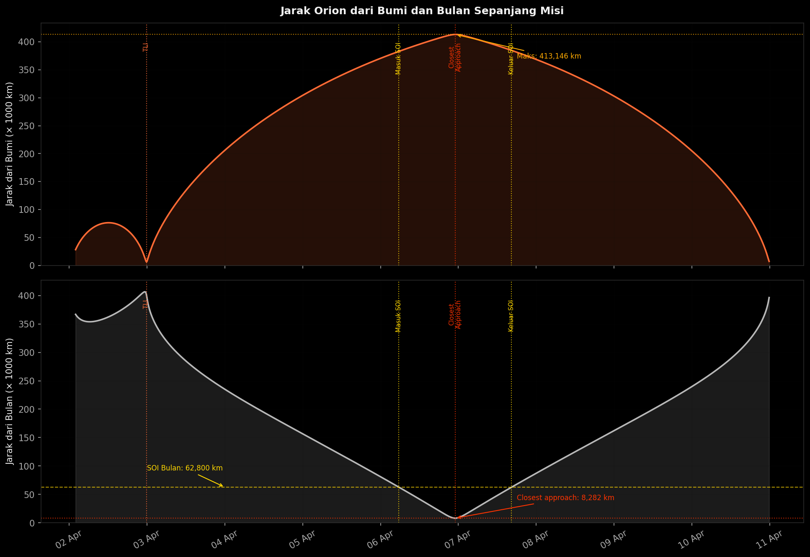
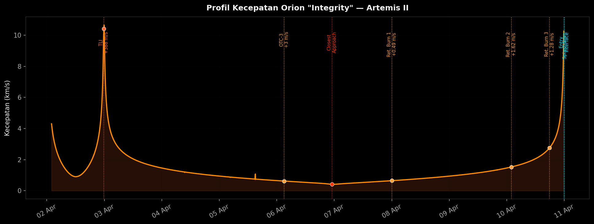
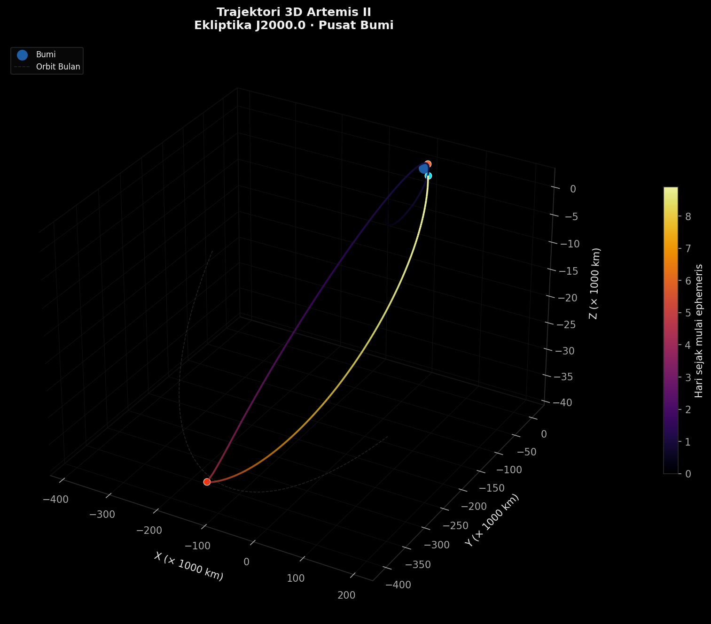

# Artemis II: Analisis Lintasan

[English](README.md) | **Bahasa Indonesia**

> *"We choose to go to the Moon not because it is easy, but because it is hard."* (John F. Kennedy)

Tanggal 1 April 2026, manusia kembali berangkat ke Bulan untuk pertama kalinya sejak era Apollo. Kali ini mereka tidak mendarat. Tujuannya membuktikan bahwa pesawat dan krunya sudah siap untuk misi berikutnya, yang nanti benar-benar akan mendarat.

Artemis II membawa empat astronaut mengitari Bulan lalu pulang lagi dalam waktu sekitar sembilan hari, naik kapsul Orion yang mereka beri nama *"Integrity"*. Saya penasaran ingin melihat sendiri perjalanan itu, jadi di repo ini saya merekonstruksi jalur yang ditempuh Orion pakai data ephemeris asli dari **NASA JPL Horizons**, lalu mengubahnya jadi grafik.


---

## Tentang misinya

Artemis II adalah penerbangan berawak pertama dalam program Artemis, penerus program Apollo. Artemis I di tahun 2022 terbang tanpa awak. Kali ini ada empat orang di dalamnya, dan mereka menempuh *free-return trajectory*. Jalur ini dibentuk sedemikian rupa sehingga kalau semua sistem mati setelah keluar dari orbit Bumi, gravitasi Bulan dan Bumi tetap akan membawa kapsul pulang tanpa perlu menyalakan mesin sekali pun.

**Kru:**
- **Reid Wiseman**, Komandan (NASA)
- **Victor Glover**, Pilot (NASA)
- **Christina Koch**, Mission Specialist (NASA)
- **Jeremy Hansen**, Mission Specialist (CSA, Kanada)

**Garis waktu singkat:**

| Hari | Yang terjadi |
|------|--------------|
| 1 | Peluncuran dari Kennedy Space Center, panel surya dibuka, penyesuaian orbit awal |
| 2 | **Translunar Injection (TLI)**: mesin menyala 5 menit 55 detik, kecepatan bertambah 388 m/s, Orion mengarah ke Bulan |
| 5–6 | Masuk wilayah pengaruh gravitasi Bulan, jarak terdekat **8.282 km** dari permukaan |
| 6 | Titik terjauh dari Bumi: **413.146 km** |
| 7–9 | Perjalanan pulang, dengan tiga kali koreksi lintasan kecil |
| 10 | Masuk atmosfer di ketinggian 122 km, mendarat di Samudra Pasifik |

---

## Isi grafiknya



Kedua kurvanya saling berkebalikan. Makin jauh Orion dari Bumi, makin dekat ia ke Bulan. Puncaknya ada di hari ke-6, saat Orion berada 413 ribu km dari Bumi tapi cuma sekitar 8 ribu km di atas permukaan Bulan.



Grafik kecepatan ini pada dasarnya memperlihatkan gravitasi yang sedang bekerja. Orion melambat waktu menjauhi Bumi, makin cepat waktu ditarik Bulan, lalu makin cepat lagi waktu jatuh pulang ke Bumi. Setiap garis vertikal menandai satu kali mesin dinyalakan untuk mengubah jalur.



---

## Data

Semua data diambil langsung dari NASA JPL Horizons System, layanan ephemeris yang juga dipakai ilmuwan dan insinyur misi NASA.

| File | Isi |
|------|-----|
| `artemis_ephemeris.txt` | Posisi dan kecepatan Orion "Integrity" (body ID `-1024`), diperbarui 10 April 2026 |
| `moon_ephemeris.txt` | Posisi Bulan (body ID `301`, DE441), interval 5 menit |

Setiap baris di antara `$$SOE` dan `$$EOE` berisi Julian Date, waktu, posisi XYZ (km), dan kecepatan VxVyVz (km/s), dalam kerangka Ekliptika J2000.0 yang berpusat di Bumi.

---

## Cara menjalankan

```bash
pip install -r requirements.txt
jupyter notebook artemis_ii_analysis.ipynb
```

Notebook-nya sudah disimpan lengkap dengan output, jadi bisa langsung dibuka dan dibaca tanpa perlu dijalankan ulang.

---

## Sumber

NASA JPL Horizons System: [ssd.jpl.nasa.gov](https://ssd.jpl.nasa.gov/horizons/)
