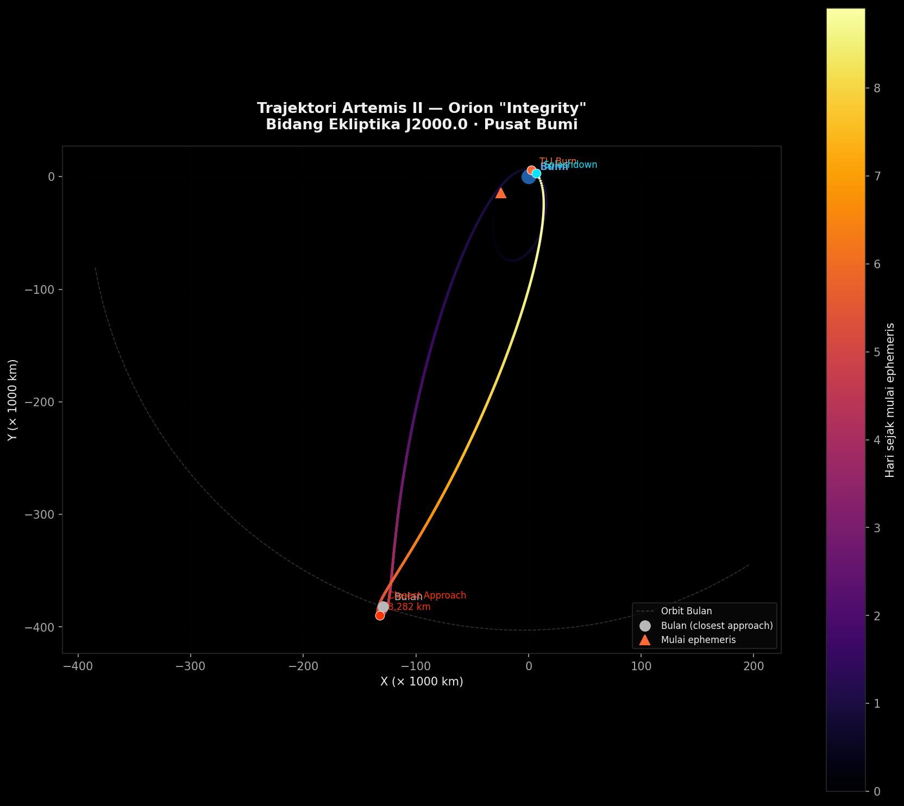

# Artemis II — Trajectory Analysis

Visualisasi trajektori misi Artemis II menggunakan data ephemeris nyata dari **NASA JPL Horizons**.



## Dataset

| File | Deskripsi |
|------|-----------|
| `artemis_ephemeris.txt` | Posisi & kecepatan Orion "Integrity" (body ID `-1024`), diperbarui 10 Apr 2026 |
| `moon_ephemeris.txt` | Posisi Bulan (body ID `301`, DE441), 5-menit step size |

Kedua file menggunakan format NASA Horizons — data dimulai setelah penanda `$$SOE` dan berakhir di `$$EOE`. Koordinat dalam km, kecepatan dalam km/s, referensi frame: Ekliptika J2000.0 pusat Bumi.

## Visualisasi

| Plot | Deskripsi |
|------|-----------|
| `trajectory_2d.png` | Jejak Orion di bidang ekliptika, gradient warna per hari |
| `trajectory_3d.png` | Trajektori 3D termasuk komponen Z (inklinasi orbit) |
| `distance_profile.png` | Jarak dari Bumi & Bulan sepanjang 9 hari misi |
| `speed_profile.png` | Profil kecepatan + annotasi setiap manuver burn |

## Cara Menjalankan

```bash
pip install -r requirements.txt
jupyter notebook artemis_ii_analysis.ipynb
```

## Fakta Misi

- **Launch**: 1 April 2026, 22:35:12 UTC — LC-39B, Kennedy Space Center
- **Kru**: Reid Wiseman, Victor Glover, Christina Koch, Jeremy Hansen (CSA)
- **Durasi**: 9 hari
- **Closest approach ke Bulan**: 8,282 km (6 April 2026)
- **Jarak maks dari Bumi**: 413,146 km
- **Kecepatan maks**: 10.65 km/s (pasca TLI burn, +388 m/s delta-v)

## Sumber Data

NASA JPL Horizons System — [ssd.jpl.nasa.gov](https://ssd.jpl.nasa.gov/horizons/)
